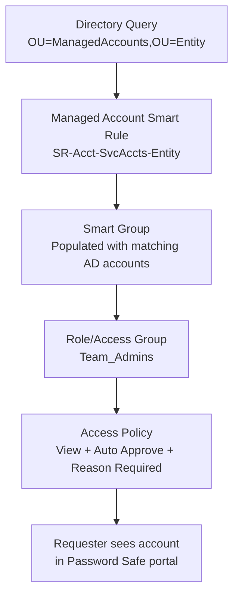

# Architecture Decisions

Design patterns and the reasoning behind them, generalized from a real multi-entity
deployment. These are opinionated defaults, not the only valid approach — but each one
solved a specific problem worth understanding before you deviate from it.

## 1. Separate functional accounts per platform — never share across roles

```
[FA-AD-Bind]        Directory / Active Directory
                     READ ONLY — AD queries and user authentication
                     CRITICAL: disabling this locks out all AD-authenticated admins

[FA-AD-Func]         Directory / Active Directory
                     Reset Password right, scoped to specific OUs only
                     Used for AD service account password rotation

[FA-Windows]         Asset / Windows
                     Local admin on target servers (via GPO)
                     Used for Windows local account discovery and rotation

[FA-SQL]             Database / MS SQL Server
                     CONNECT SQL + ALTER ANY LOGIN on each instance
                     Used for SQL login discovery and rotation

[FA-Oracle]          Database / Oracle
                     CONNECT + ALTER USER + SELECT ON DBA_USERS
                     Used for Oracle account discovery and rotation
```

**Why this matters:** the bind account is read-only infrastructure — if it's ever
disabled or its password drifts out of sync, every AD-authenticated admin is locked
out of the console simultaneously (see lessons-learned #1). The rotation account
(`FA-AD-Func`) has *write* permission, but only on specific OUs. These must never be
the same account: a compromise of the read-only bind account should never also grant
write access to every managed credential. This is the actual security reasoning, not
just a naming convention — least privilege and blast-radius reduction, applied to the
platform's own service accounts.

## 2. Dedicated OU structure for managed accounts

Keep Password Safe–managed service accounts in their own OU branch, separate from
both general production accounts and the platform's own functional accounts:

```
<DOMAIN>
└── <Entity/Business-Unit>
    └── Users
        └── ServiceAccounts
            └── PasswordSafe
                ├── ManagedAccounts       ← production service accounts, managed by PS
                └── FunctionalAccounts    ← PS's own functional accounts (break-glass)
```

**Why the FunctionalAccounts OU is separate:** it keeps the platform's own service
accounts from ever being accidentally swept up into its own managed-account rotation
via an overly broad Smart Rule. They're deliberately kept outside normal rotation and
managed manually as a break-glass safeguard — if the appliance itself is unavailable,
you don't want its own credentials to have been rotated by the thing that's down.

## 3. Three-tier Smart Rule model



**Tier 1 — Directory Queries:** one per entity/business unit, scoped to that entity's
`ManagedAccounts` OU.

**Tier 2 — Managed Account Smart Rules:** consume the Directory Query, produce a
Smart Group, carry the "Manage Account Settings" action (rotation frequency, release
duration, etc.).

**Tier 3 — Access:** role/access groups mapped to Requestor (or other) roles, paired
with an Access Policy on each Smart Group.

**Why three tiers instead of one big rule:** it keeps discovery scope (tier 1),
rotation/settings behavior (tier 2), and human access (tier 3) independently
adjustable. You can change who has access without touching rotation settings, or
change rotation frequency without touching the underlying directory query. Collapsing
these into fewer, broader rules makes each change riskier because it's harder to
predict what else that rule controls.

## 4. Secrets Safe governance — admin-controlled Safe creation

**Decision: only Password Safe administrators create Safes.** Teams submit a request;
an admin creates the Safe and grants access. This is a deliberate trade-off — it adds
a small amount of friction to onboarding a new team, in exchange for preventing Safe
sprawl (dozens of ad-hoc, inconsistently-permissioned Safes that nobody owns).

**Naming convention:**
```
[Type]-[Team/Application]-[Purpose]

Examples:
SS-SecurityTools-SharedCreds
SS-BackupRecovery-SharedCreds
SS-NetworkInfra-SharedCreds
```

**Permission split — two independent gates:**
```
Feature level (User Management → Groups → Features):
  Regular teams   →  Read Only    (can use Safes, cannot create new ones)
  Admin team      →  Full Control (can create and manage Safes)

Safe level (per Safe):
  Read / Create / Update / Delete Secrets  ✅ (team-specific)
  Manage Safe                              ❌ (admin only)
```
Feature-level permission and Safe-level permission are **not** the same gate — a user
with Full Control at the feature level still only sees the specific Safes they've been
granted access to. Don't assume broad feature permission implies broad visibility.

## 5. Local Windows account strategy

```
Built-in local admin (renamed)  →  LAPS (a different tool manages it — do not
                                    also try to manage it via Password Safe)
Non-LAPS local accounts         →  Password Safe discovery + case-by-case management
Service accounts                →  Password Safe rotation via the AD functional account
Break-glass local accounts      →  Secrets Safe (static storage, not rotated)
```

**Before adding a Windows functional account to any server group, confirm LAPS scope
on those servers first.** Accounts under LAPS management will reject Password Safe's
rotation attempts (see lessons-learned #11) — this isn't a bug to troubleshoot, it's
two tools with overlapping intent that need a clear boundary drawn between them.
